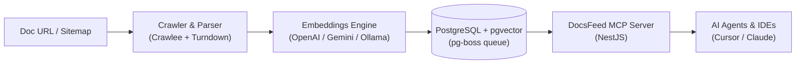

# System Architecture

**DocsFeed MCP** turns any documentation website into an authenticated, queryable **Model Context Protocol (MCP)** server for AI coding agents (Cursor, Claude Desktop, Windsurf).

---

## 1. High-Level Flow

1. **Submit**: User inputs a documentation URL or sitemap via the Next.js Dashboard.
2. **Crawl & Chunk**: The crawler visits pages, extracts core content, converts HTML to Markdown, and splits text into semantic chunks.
3. **Embed & Store**: Embeddings are generated and persisted into PostgreSQL with `pgvector`.
4. **Serve via MCP**: The NestJS server exposes dedicated MCP endpoints protected by scoped API keys.
5. **Query**: AI clients call native MCP tools (`search_docs`, `get_page`, `list_sections`) to pull verified, fresh documentation during reasoning.

---

## 2. Core Subsystems

### A. Web Dashboard (`/web`)
* **Role**: Administrative UI for creating feeds, reviewing crawl status, testing endpoints, and checking server health.
* **Tech**: Next.js 16 (Turbopack, App Router), Tailwind CSS, Shadcn UI (Emerald theme).

### B. Core Backend & MCP Server (`/server`)
* **Role**: REST API for dashboard management and SSE/Stream transport for MCP client connections.
* **Tech**: NestJS, `@modelcontextprotocol/sdk`, Prisma ORM (v7).

### C. Ingestion & Crawling Engine
* **Role**: Headless recursive crawler that extracts structured Markdown from web pages while removing boilerplate (headers, sidebars, ads).
* **Tech**: Crawlee, Playwright, Turndown.

### D. Embeddings & Vector Search
* **Role**: Pluggable embedding service converting Markdown chunks into high-dimensional vectors for semantic similarity queries.
* **Supported Providers**:
  * Cloud: OpenAI (`text-embedding-3-small`), Gemini.
  * Local/Offline: Ollama (`nomic-embed-text`).

### E. Storage & Job Queue (Zero-Redis Architecture)
* **Single Source of Truth**: PostgreSQL with `pgvector` extension handles both relational entities (Users, Feeds, Pages) and vector embeddings.
* **Asynchronous Jobs**: Background tasks (crawling, re-indexing) are managed directly inside PostgreSQL using **`pg-boss`**, eliminating the need for an external Redis service.

---

## 3. MCP Tool Interface

When an AI agent connects to a DocsFeed endpoint, it receives access to three native tools:

| Tool | Purpose | Primary Parameter |
| :--- | :--- | :--- |
| `search_docs` | Vector similarity search over documentation chunks | `query: string` |
| `get_page` | Retrieves the full Markdown content of a specific page | `path: string` |
| `list_sections` | Returns the table of contents and indexed document hierarchy | *none* |

---

## 4. Security & Isolation

* **Isolated Endpoints**: Each documentation source generates a unique MCP endpoint URL: `http://localhost:4000/mcp/<source-id>`.
* **Scoped Authentication**: Endpoints require a dedicated Bearer token (`df_live_...`). An API key only has read access to its specific documentation index.
* **Serverless Compatibility**: Database connections support direct pooling with SSL mode for providers like Neon and Supabase.
